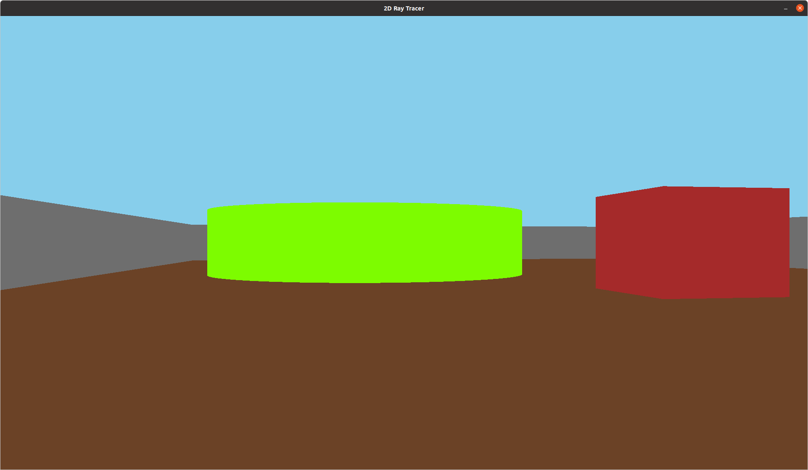

# 3D Ray Tracer
Event handlers are implemented:
    - The X-Y position of the camera can be adjusted using the WASD keys
    - The field of view can be rotated left-right using the mouse

### To build and run the code
- Make sure you have SDL library installed. If not, install it by running the command given below, else proceed to the next steps
    - sudo apt-get install libsdl2-2.0
- Clone the repository
- Follow the below Command Line instructions (inside the directory where the repo has been cloned):
    - cd 2d-ray-tracer
    - mkdir build
    - cd build
    - cmake ..
    - make
    - ./2D_RAY_TRACER
    
    

- The average calculation time per frame is saved as a .txt file after the program is closed
